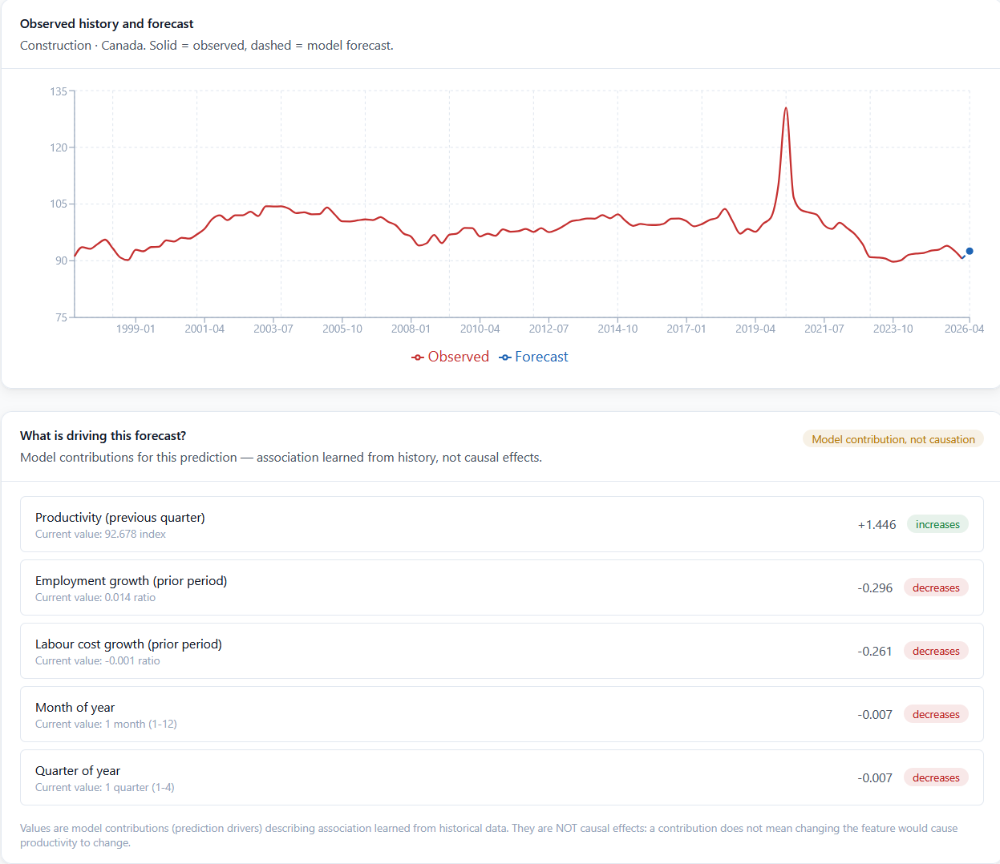
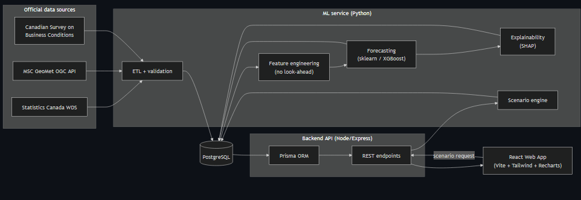
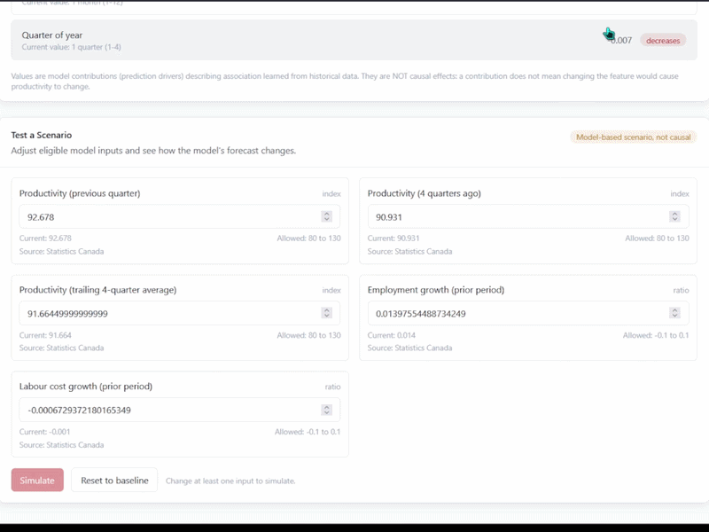
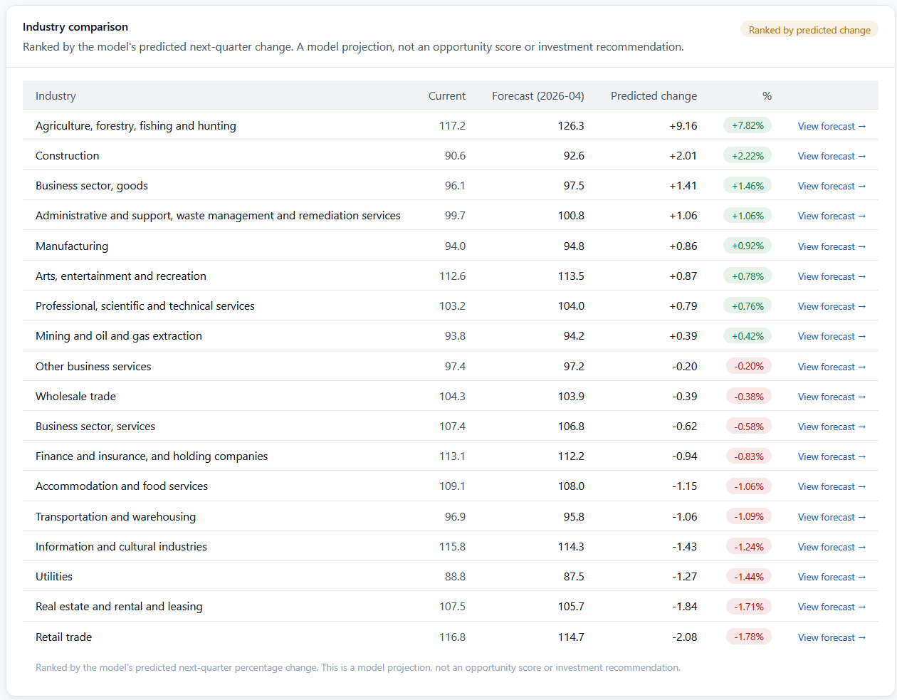
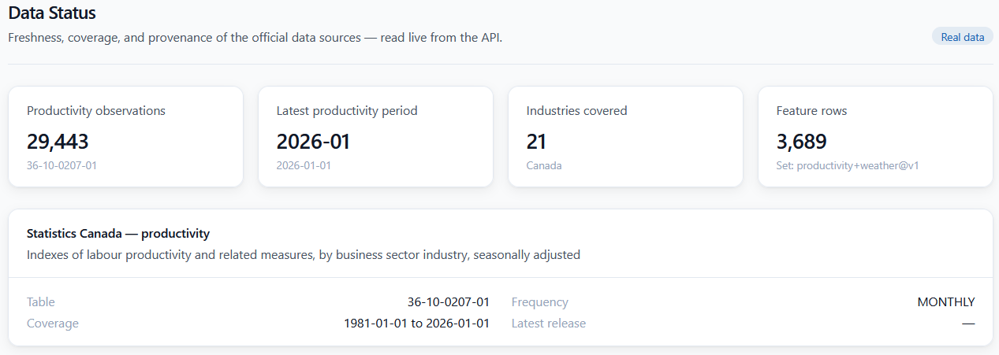

<!--
=============================================================================
 PORTFOLIO — Canada Productivity Intelligence
=============================================================================
 This scaffold follows "The Sahil and Daniel Co-op Resume Guide" portfolio rules:
   - The portfolio is a SEPARATE, freeform document that goes AFTER your resume
     (ideally appended to the same PDF so a reader scrolling past page 1 lands
     on it instead of blank space).
   - Structure it PROJECT BY PROJECT. Match your resume's styling/branding
     (same name + contact header, same fonts, grayscale).
   - Each showcase block ≈ half a page: ~half imagery (screens/GIFs/diagrams),
     ~half bullet points discussing IMPLEMENTATION and CHALLENGES.
   - Show, don't tell: prioritize imagery, block diagrams, and links to the
     repo / docs. Words are the hook to a deeper story.
   - Most impressive item first.
   - Anything you put here is fair game for technical interview questions.

 HOW TO USE THIS FILE:
   - Replace every [BRACKETED] note with your own words or a real link.
   - Drop image files next to this file (or in an ./assets folder) and update
     the image paths. Recommended captured assets are listed in each block.
   - GIFs are best for INTERACTIONS (simulating a scenario, ranking updating).
     PNGs are best for STATIC screens and diagrams.
   - When you export to PDF, keep the total file (resume + portfolio) under
     ~10 MB; compress large PNGs/GIFs if needed.
=============================================================================
-->

# Portfolio — Murad Dashdamirov

dashdamirov.murad11@gmail.com | [LinkedIn](https://www.linkedin.com/in/murad-dashdamirov-90461934a) | [GitHub](https://github.com/Murad-D-11)

<!-- Keep this header identical in style to your resume header for consistent personal branding. -->

---

## Canada Productivity Intelligence

*An explainable, full-stack platform that turns public Statistics Canada data into a next-quarter labour-productivity forecast, per-forecast driver attributions, and a what-if scenario simulator.*

**Stack:** React + TypeScript (Vite, Tailwind, Recharts) · Node + Express + TypeScript (Prisma) · Python (scikit-learn, pandas) · PostgreSQL · Docker
**Links:** [Repository](https://github.com/Murad-D-11) &nbsp;|&nbsp; [Methodology write-up](#) <!-- link docs/methodology.md rendered, or a hosted page -->

<!--
SHOWCASE PRIORITY (what to lead with and why) — read this, then delete it:

  1. HERO SHOT: the Forecast screen with the observed-vs-forecast chart AND the
     "what is driving this forecast" driver breakdown visible together. This is
     the single most impressive frame: it proves the model runs end-to-end AND
     is explainable. Lead with it.
  2. ARCHITECTURE DIAGRAM: the three-tier flow (React -> Express API -> Python
     ML bridge -> PostgreSQL). Engineers reading a portfolio love a clean block
     diagram; it shows you can reason about systems, not just screens.
  3. SCENARIO SIMULATOR (as a GIF): the interaction of changing an input and
     watching baseline-vs-scenario update is your most "alive" moment. Motion
     sells interactivity better than a static shot.
  4. NATIONAL OVERVIEW: industries ranked by predicted change — shows breadth
     (all 21 industries, one request) and data scale.
  5. DATA STATUS / INGESTION: proof the 29,443-observation StatCan pipeline is
     real. Optional; include if you have space and want to emphasize data eng.

  Prioritize FORECAST + EXPLAINABILITY + ARCHITECTURE. Those three carry the
  project. Everything else is supporting evidence.
-->

### 1. Forecast & Explainability (hero)

<!--
  IMAGE: PNG. Capture the Forecast page for one industry with BOTH visible:
    - the Recharts observed-vs-forecast line chart, and
    - the "What is driving this forecast?" driver contribution breakdown.
  Caption idea below.
-->
*Next-quarter forecast for a selected industry, with the exact per-feature contributions that produced it.*

- Forecasts next-quarter labour productivity for a chosen industry and renders the observed history against the projected point, with absolute and percentage change versus the latest observed value.
- Explains every prediction exactly: the linear model's output is decomposed into a base value plus each feature's contribution (`coefficient × scaled value`), so the top drivers are deterministic — no SHAP approximation.
- [CHALLENGE — 1–2 sentences in your words: e.g., how you kept the frontend from ever building ML inputs, and how the API returns typed errors instead of fabricating a forecast when the model or data is unavailable.]

### 2. System Architecture

<!--
  YOU ALREADY HAVE DIAGRAMS: docs/architecture.md contains 7 Mermaid diagrams
  (system, component, data flow, ER, ML flow, deployment). REUSE the system
  diagram (section 1) as the basis rather than drawing from scratch.

  TWO IMPORTANT CAVEATS:
  1. Mermaid does NOT render inside a PDF. To get a PNG, either screenshot the
     rendered diagram from GitHub, or paste the Mermaid source into
     https://mermaid.live and export PNG/SVG, or use a VS Code Mermaid
     extension. Save it as assets/cpi-architecture.png.
  2. docs/architecture.md is partly ASPIRATIONAL and does NOT match the shipped
     code. Before you screenshot, make the diagram match what actually runs, or
     an interviewer will catch the gap. Real vs. doc:
       - Explainability: EXACT linear coefficient decomposition (NOT SHAP).
       - Models: ridge / random forest / naive baseline (NOT XGBoost).
       - No prediction intervals (no lower/upper bounds are produced).
       - Data source: Statistics Canada only (weather wired but not ingested;
         no Canadian Survey on Business Conditions).
       - Real forecast/scenario endpoints live under /api/v1.
       - Python is invoked via a JSON stdin/stdout bridge (python -m
         cpi_ml.bridge), not a long-running service.
  Accurate shape to show:
     React SPA -> Express/TS REST API (Prisma) -> JSON stdin/stdout bridge ->
     Python cpi_ml (scikit-learn: ridge/RF + exact linear attribution) ;
     Express <-> PostgreSQL. Label the boundary: "frontend never builds ML
     feature vectors."
-->
*Frontend calls REST only; the backend owns feature retrieval and invokes the Python model through a JSON stdin/stdout bridge.*

- Separated responsibilities across three tiers so Python internals never reach the browser: the Node/Express API retrieves the feature vector from PostgreSQL via Prisma and calls `python -m cpi_ml.bridge` with a JSON request on stdin, reading a JSON response on stdout.
- Mapped ML bridge error codes to appropriate HTTP statuses (untrained model → 503, bad input → 400, upstream failure → 502) so the system fails honestly instead of guessing.
- [CHALLENGE — why a stdin/stdout bridge over a queue/microservice: simplest integration that fit the architecture, no extra infrastructure.]

### 3. Scenario Simulator (interaction)

<!--
  IMAGE: GIF. Record yourself changing an eligible input (e.g., employment
  growth) and the baseline-vs-scenario forecast updating, then resetting to
  baseline. Keep it short (a few seconds) and under a couple MB.
-->
*A what-if tool: adjust an eligible input and compare the model's baseline forecast against the scenario response.*

- Lets users perturb eligible inputs and compare a baseline forecast against the scenario result, with validation that rejects unknown, out-of-range, or non-controllable features (targets, lags, calendar fields).
- Surfaces a clear non-causal disclaimer: a scenario is the model's response to changed inputs, not a claim about the real economy.
- [CHALLENGE — how you decided which features are user-eligible, and where that rule lives (central feature metadata).]

### 4. National Overview — Industry Ranking

<!-- IMAGE: PNG of the Overview page showing the ranked industry table/chart. -->
*All industries forecast in a single model process and ranked by predicted next-quarter change.*

- Forecasts every industry's next quarter in one batched model call and ranks them by predicted percentage change, framed explicitly as a model projection rather than an investment signal.
- [Optional bullet in your words: any UI/UX choice you made to keep the ranking readable — Recharts, sorting, null handling.]

### 5. Data Pipeline & Provenance (optional)

<!-- IMAGE: PNG of the Data Status page, OR a small table/screenshot of the ingestion report. -->
*Real Statistics Canada ingestion with full provenance; no values are imputed at rest.*

- Ingested 29,443 Statistics Canada observations across 21 industries and 8 measures (coverage 1981–2026) into PostgreSQL, preserving source provenance and leaving suppressed values as null rather than fabricating them.
- Engineered a 7-feature, past-only matrix (lagged productivity, rolling mean, employment/labour-cost growth, calendar fields) with `shift(1)` to guarantee no look-ahead leakage.
- [Optional CHALLENGE — anything about the ETL quality checks or the ingestion report you generated.]

---

<!--
 ASSET CHECKLIST (create an ./assets folder next to this file):
   [ ] assets/cpi-forecast.png       — hero: forecast chart + driver breakdown
   [ ] assets/cpi-architecture.png   — three-tier block diagram
   [ ] assets/cpi-scenario.gif       — scenario simulator interaction
   [ ] assets/cpi-overview.png       — national industry ranking
   [ ] assets/cpi-data-status.png    — ingestion / data provenance (optional)

 CAPTURE TIPS:
   - Use a clean browser window, no dev tools, consistent zoom.
   - For GIFs, keep them 3–6 seconds and compress (ScreenToGif / Kap / gifski).
   - Diagrams: grayscale to match resume styling; label the boundaries.
   - Every image should earn its space — if it doesn't show implementation or
     a result, cut it.
-->
