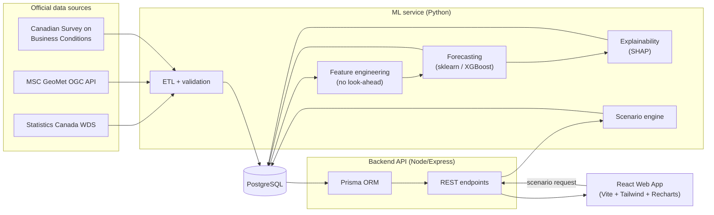
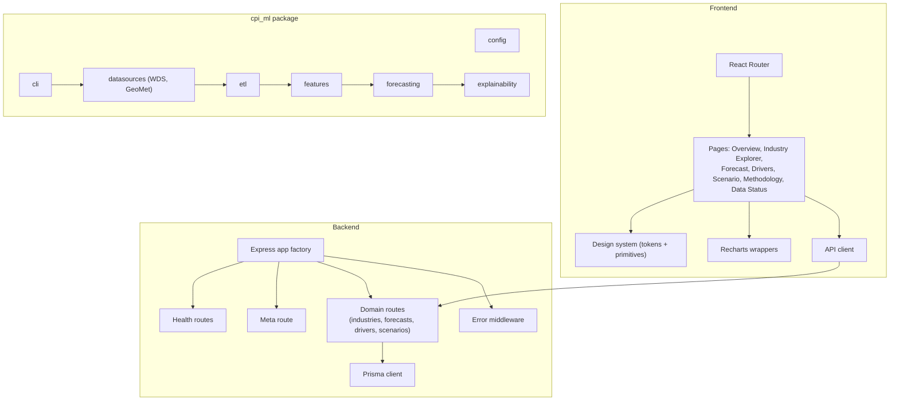
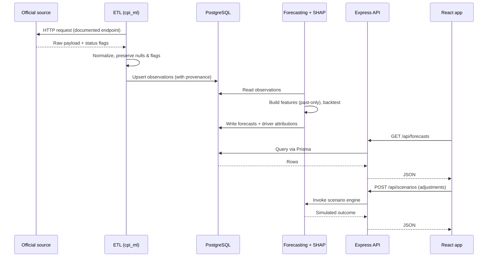
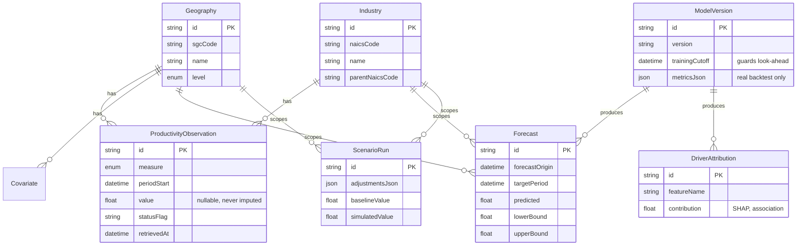
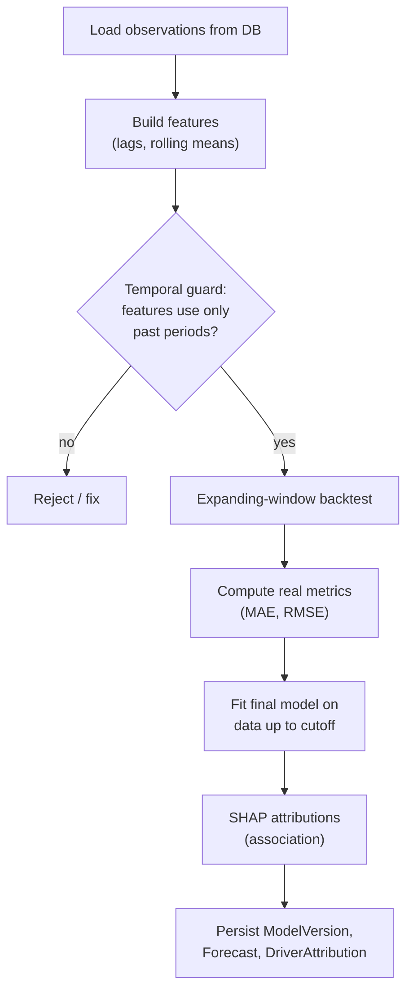
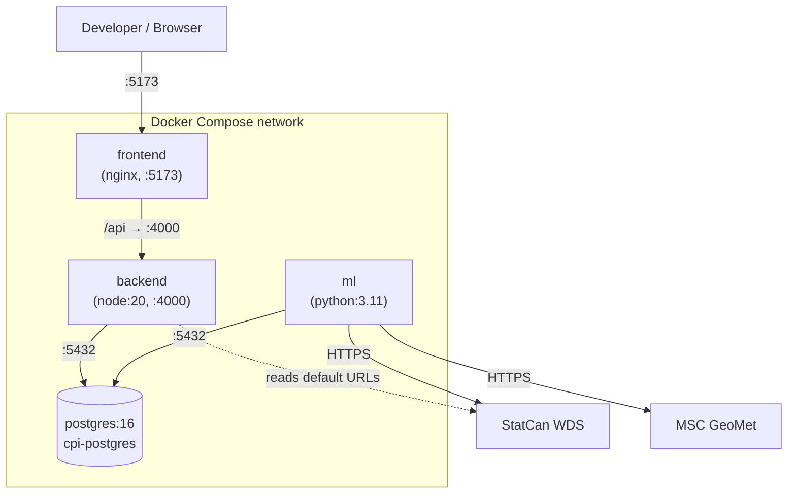

# Architecture — Canada Productivity Intelligence

This document describes the system architecture, the flow of data through it,
and the rationale behind each major decision. Diagrams use Mermaid so they
render in GitHub and most Markdown viewers.

The end-to-end workflow is:

> Government Data → ETL → PostgreSQL → ML Forecasting → Explainability → Scenario Simulation → React Web App

---

## 1. System architecture

**Why this shape.** The ML service and the API are separate concerns. The ML
service is a batch/pipeline system (fetch, train, explain) that writes results
into PostgreSQL. The API is a thin, stateless read layer over those results
plus an on-demand scenario endpoint. Keeping them decoupled means the web app
never blocks on model training, and the model pipeline can run on its own
schedule.

---

## 2. Component diagram

**Why this shape.** Each layer has a single responsibility and a stable seam:
pages depend on an API client (not on fetch details), routes depend on Prisma
(not on SQL), and the ML CLI orchestrates independently testable modules. This
satisfies the modularity and testability requirements.

---

## 3. Data flow

**Why this shape.** Provenance and source status flags travel with every
observation so the platform can be transparent about data quality and never
present imputed values as observed. Predictions are written to dedicated tables,
never mixed with observations.

---

## 4. Database flow (entity relationships)

**Why this shape.** `ProductivityObservation.value` is nullable so genuinely
unreleased data stays null rather than being filled. `ModelVersion.trainingCutoff`
records the last period used in training, making look-ahead leakage auditable.
`Forecast.forecastOrigin` records the point from which a prediction was made.

---

## 5. ML flow

**Why this shape.** Validation always uses periods strictly after the training
window (expanding-window backtest), so reported accuracy reflects genuine
out-of-sample performance and never uses future information. Metrics are
computed, not asserted. SHAP explains association between features and
predictions; the UI and docs must not phrase these as causal.

---

## 6. Deployment diagram

**Why this shape.** Compose gives a single-command local environment with a
health-gated startup order (backend and ML wait for a healthy Postgres). The
frontend is served as static files by nginx in production images, while `npm
run dev` provides HMR during development. Only the ML service needs outbound
internet access for data collection in normal operation.

---

## 7. Key architectural decisions

| Decision | Rationale | Trade-off accepted |
| --- | --- | --- |
| Monorepo with npm workspaces (frontend, backend) + standalone Python ML package | One clone, consistent tooling, atomic cross-cutting changes | Slightly more complex root config |
| Separate ML pipeline from API | Web requests never block on training; pipelines run on their own cadence | Requires a shared datastore contract |
| PostgreSQL + Prisma | Relational integrity for time series + typed DB access in TypeScript | ORM abstraction over raw SQL tuning |
| Prisma schema at repo root `/prisma` | Shared contract usable by backend and (conceptually) ML | Backend references a path outside its folder |
| Nullable observation values + status flags | Never present imputed data as observed | Consumers must handle nulls explicitly |
| `trainingCutoff` + `forecastOrigin` fields | Make look-ahead leakage auditable at the data layer | Extra bookkeeping per model run |
| Expanding-window backtesting | Honest out-of-sample metrics; no future leakage | Fewer eval points than k-fold on early data |
| SHAP for explainability, labelled "association" | Interpretable drivers without overclaiming causation | Attribution ≠ causal effect; must be communicated |
| Semantic design tokens via CSS variables | Theming without recompiling utilities; consistent UI | Indirection between color name and value |
| Domain API endpoints return `501` until wired | Discoverable contract without fabricating data | Frontend must render honest empty states |
| Config via validated env vars (Zod / pydantic) | Fail fast on misconfiguration; same code across envs | Requires an `.env` for non-defaults |

---

## 8. Non-negotiable guarantees reflected in the design

- No fabricated data, endpoints, metrics, or API responses.
- No future information in training (`trainingCutoff`, past-only features,
  expanding-window validation).
- No silent interpolation of target values (nullable values + status flags).
- No causal claims (SHAP attributions are labelled as association).
- Modularity, tests per feature, per-service documentation, and a project that
  stays runnable at every commit.
